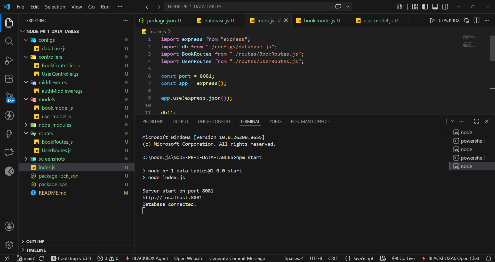
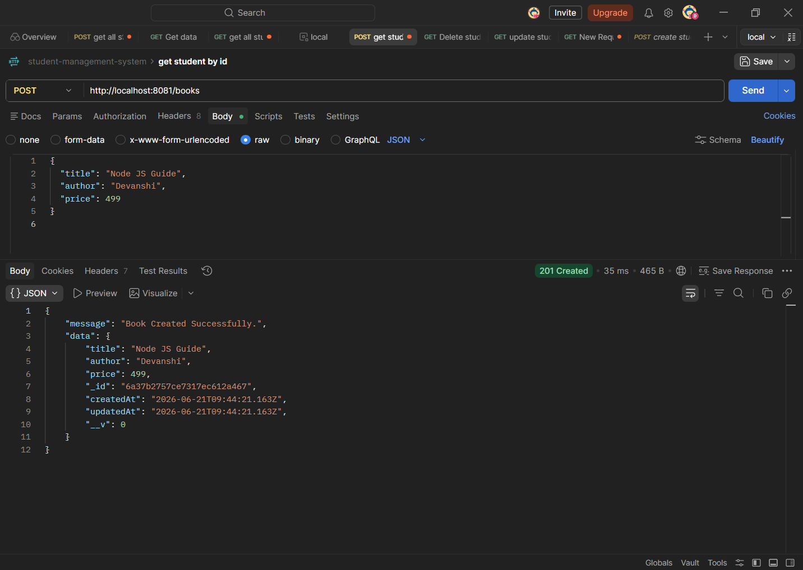
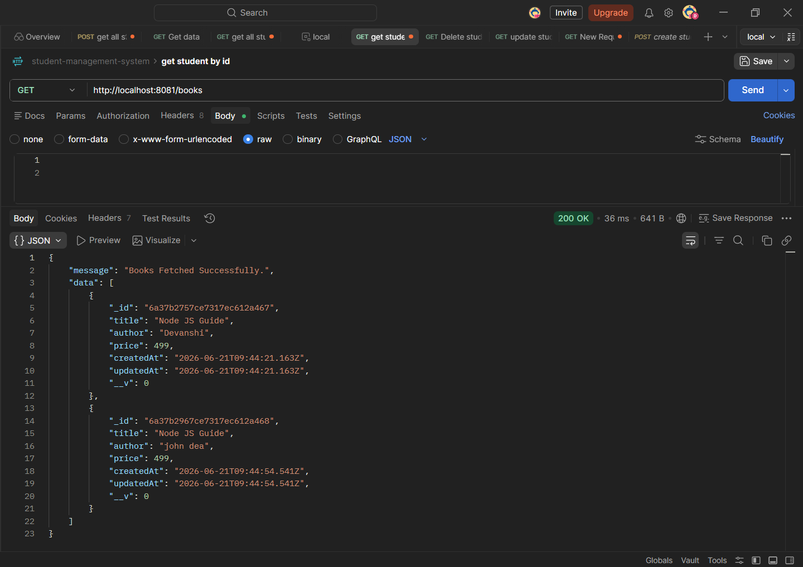
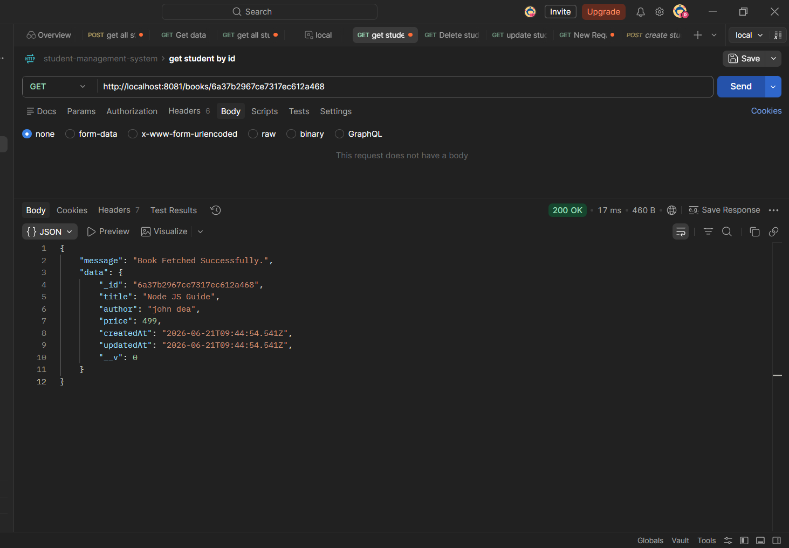
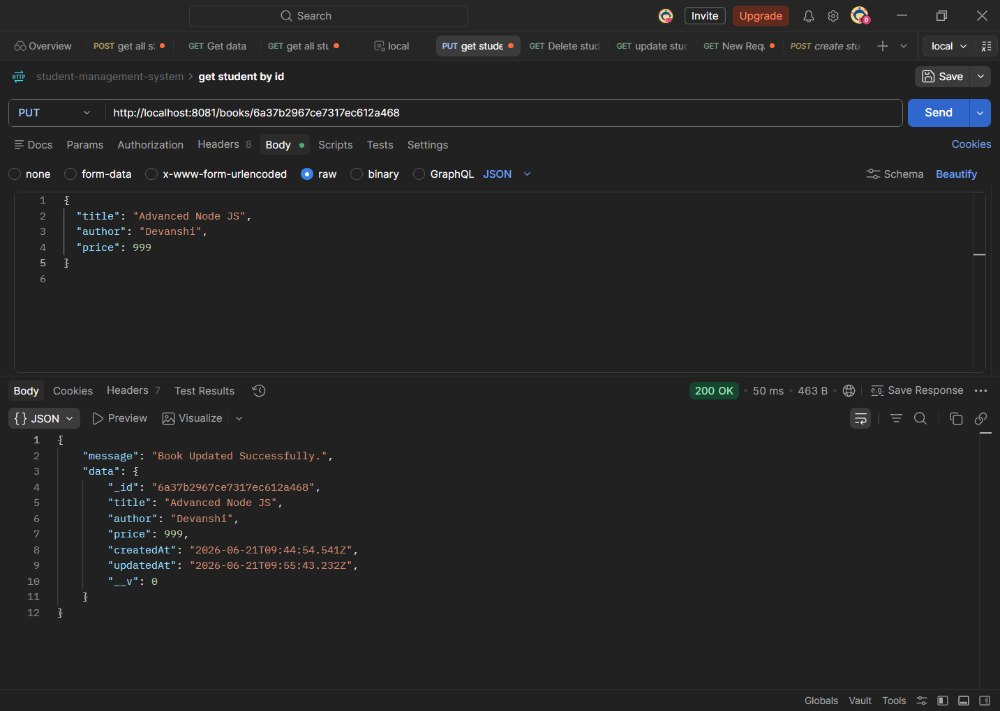
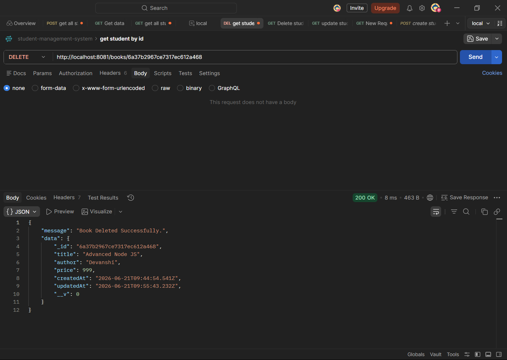
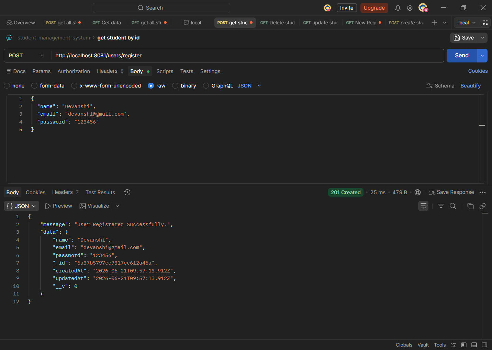
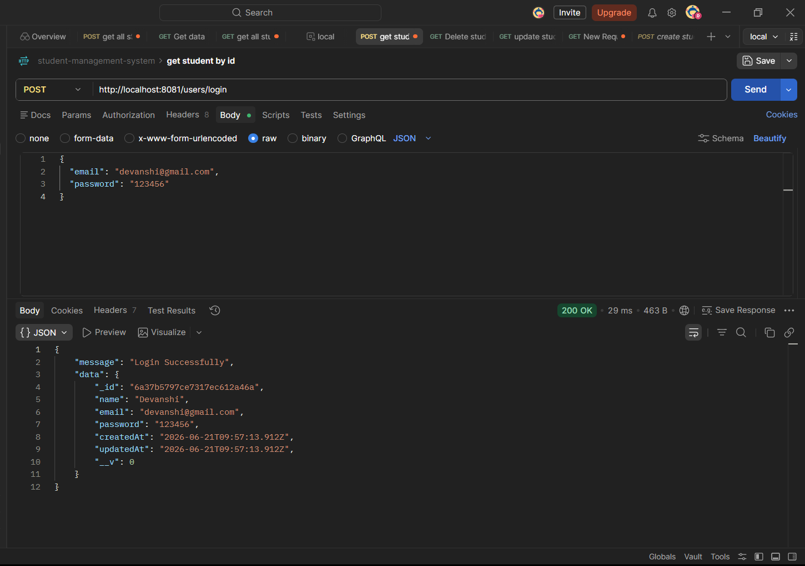
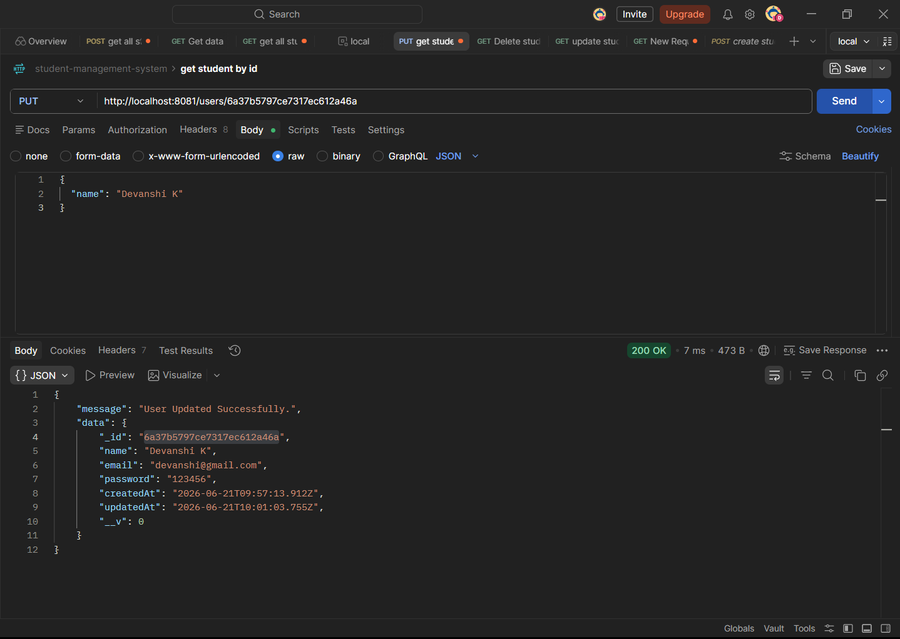

# 📚 Book Store Management API

A RESTful API built using **Node.js**, **Express.js**, and **MongoDB (Mongoose)** for managing Books and Users. This project demonstrates CRUD operations, route separation, controllers, models, middleware, and MongoDB integration.

---

## 🚀 Features

### 📖 Book Management
- Create Book
- Get All Books
- Get Book By ID
- Update Book
- Delete Book

### 👤 User Management
- Register User
- Login User
- Get All Users
- Get User By ID
- Update User
- Delete User

### 🔐 Middleware
- Authentication Middleware using Email Header
- User Verification

---

## 🛠️ Technologies Used

- Node.js
- Express.js
- MongoDB
- Mongoose
- Express Validator

---

## 📂 Project Structure

```
NODE-PR-1-DATA-TABLES
│
├── configs
│   └── database.js
│
├── controllers
│   ├── BookController.js
│   └── UserController.js
│
├── middlewares
│   └── authMiddleware.js
│
├── models
│   ├── book.model.js
│   └── user.model.js
│
├── routes
│   ├── BookRoutes.js
│   └── UserRoutes.js
│
├── screenshots
│
├── index.js
├── package.json
└── README.md
```

---

## ⚙️ Database Configuration

MongoDB Connection:

```javascript
mongoose.connect(
  "mongodb://127.0.0.1:27017/bookstore"
);
```

---

## 🌐 API Endpoints

### 📖 Book Routes

| Method | Endpoint | Description |
|----------|-------------|-------------|
| POST | /books | Create Book |
| GET | /books | Get All Books |
| GET | /books/:id | Get Book By ID |
| PUT | /books/:id | Update Book |
| DELETE | /books/:id | Delete Book |

---

### 👤 User Routes

| Method | Endpoint | Description |
|----------|-------------|-------------|
| POST | /users/register | Register User |
| POST | /users/login | Login User |
| GET | /users | Get All Users |
| GET | /users/:id | Get User By ID |
| PUT | /users/:id | Update User |
| DELETE | /users/:id | Delete User |

---

## 📋 Sample Request

### Create Book

```json
{
  "title": "Node JS Guide",
  "author": "Devanshi",
  "price": 499
}
```

### Register User

```json
{
  "name": "Devanshi",
  "email": "devanshi@gmail.com",
  "password": "123456"
}
```

---

## 📸 Output Screenshots

### Server Running



### Create Book



### Get All Books



### Get Book By ID



### Update Book



### Delete Book



### User Registration



### User Login



### Update User



---

## 📜 Available Scripts

### Run Server

```bash
npm start
```

### Run in Watch Mode

```bash
npm run dev
```

---

## 🎥 Project Explanation Video

Watch the complete project explanation video here:

🔗 https://drive.google.com/file/d/15zfgkLGxJLR18DrGF99Y6pOv1na5BkVC/view?usp=sharing

---

## 📌 Conclusion

The Book Store Management API is a RESTful backend application developed using Node.js, Express.js, MongoDB, and Mongoose. The project successfully implements CRUD operations for both Books and Users while following the MVC (Model-View-Controller) architecture.

This project demonstrates key backend development concepts such as routing, controllers, database integration, middleware usage, and API testing. It serves as a strong foundation for understanding REST API development and can be further enhanced by adding features such as JWT authentication, password encryption, role-based access control, and deployment.

Overall, this project provides practical experience in building scalable and maintainable backend applications using modern JavaScript technologies.